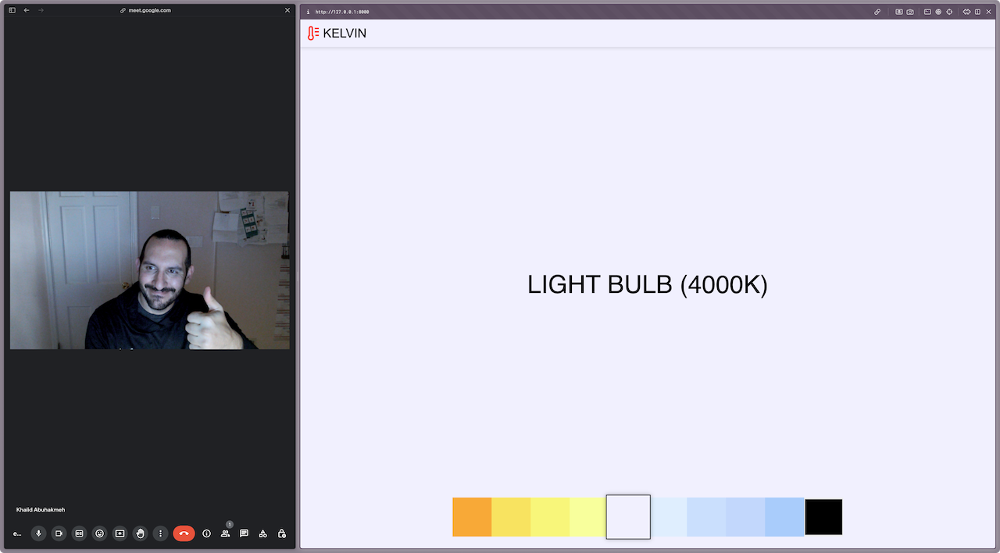

# Kelvin - The Kelight Web App

**Check it out at https://kelvin-keylight.netlify.app**

I designed this simple HTML/CSS/JS web app to allow folks to use a display as a potential keylight. For those that
prefer to sit in darker rooms, this app will use your monitor's ability to create blindingly vivid lights to illuminate
you during video calls.

No need for an expensive keylight.

## How to use

1. For single-monitor users, use your operating system's split-screen windowing feature. This should allow you to have
   the majority of the display showing the keylight while having access to your video streaming app, presentations, or
   anything else you'd like.
2. Pick the light's temperature from the bottom bar. You can also use the color picker on the far right to choose any
   custom color.
3. Enjoy your meeting being well lit.

## Logo Attribution

[Temperature](https://thenounproject.com/icon/temperature-4710358/) by Alexander Yordan Mulia

## License

[MIT](./license.md)